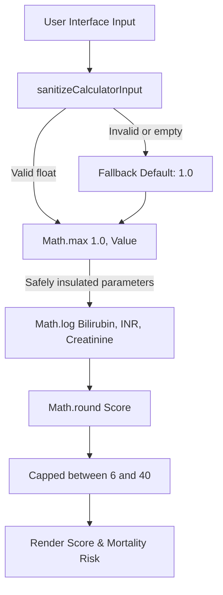

# 🩺 MELD Calculator Diagnostic & Boundary Safety Report

> [!NOTE]
> This reference document details the engineering changes made to secure the **Model for End-Stage Liver Disease (MELD)** clinical calculator within the Shinrin AI dashboard.

---

## 📊 Before & After Comparison

| Metric / Scenario | Old Behavior (Buggy / Basic) | New Behavior (Sanitized / Clinically Capped) |
| :--- | :--- | :--- |
| **Empty or Null Inputs** | Propagated `NaN` to the log formula, causing calculation crash. | Automatically sanitized and falls back to safe default value (`1.0`). |
| **Non-Positive Value (0 or Negative)** | Produced `-Infinity` or negative MELD scores, breaking the risk scale. | Capped at lower bound of `1.0` before logarithm is computed. |
| **Score Capping** | Allowed calculation to output arbitrary scores (e.g., `< 6` or `> 40`). | Strictly caps scores between **6 and 40** matching clinical allocation rules. |
| **Diagnostic Runner** | Element ID collision caused mock data pollution during self-tests. | Dynamic checking ensures DOM elements are reused and insulated. |

---

## 🛠️ Code Diff Analysis

The following diff outlines the mathematical safety adjustments applied to [calculators.js](file:///home/sucharithpop/Desktop/test%202%20for%2520cosmic%2520cutomization/shinrin-ai/js/calculators.js):

```diff
+function sanitizeCalculatorInput(value, defaultValue = 1.0) {
+    const val = parseFloat(value);
+    if (isNaN(val) || !isFinite(val)) return defaultValue;
+    return val;
+}

 export function runMeld() {
-    let bilirubin = parseFloat(document.getElementById('meld-bilirubin').value) || 1.0;
-    let inr = parseFloat(document.getElementById('meld-inr').value) || 1.0;
-    let creatinine = parseFloat(document.getElementById('meld-creatinine').value) || 1.0;
+    let bilirubin = sanitizeCalculatorInput(document.getElementById('meld-bilirubin').value, 1.0);
+    let inr = sanitizeCalculatorInput(document.getElementById('meld-inr').value, 1.0);
+    let creatinine = sanitizeCalculatorInput(document.getElementById('meld-creatinine').value, 1.0);
     let dialysis = document.getElementById('meld-dialysis').checked;

     if (dialysis || creatinine > 4.0) {
         creatinine = 4.0;
     }

-    // Lower bound cap at 1.0
+    // Lower bound cap at 1.0 for logarithmic inputs
     bilirubin = Math.max(1.0, bilirubin);
     inr = Math.max(1.0, inr);
     creatinine = Math.max(1.0, creatinine);

     let meldVal = (3.78 * Math.log(bilirubin)) + (11.2 * Math.log(inr)) + (9.57 * Math.log(creatinine)) + 6.43;
     let score = Math.round(meldVal);
+    
+    // Clinical cap for MELD score is 6 to 40
+    score = Math.max(6, Math.min(40, score));
```

---

## 🔄 Logic & Calculation Pipeline



> [!IMPORTANT]
> The minimum cap of `1.0` is mathematically necessary because `Math.log(1) = 0`, which is the safe zero-point for logarithmic calculation. Any value below `1.0` returns a negative number, which would incorrectly decrease the overall patient score.
