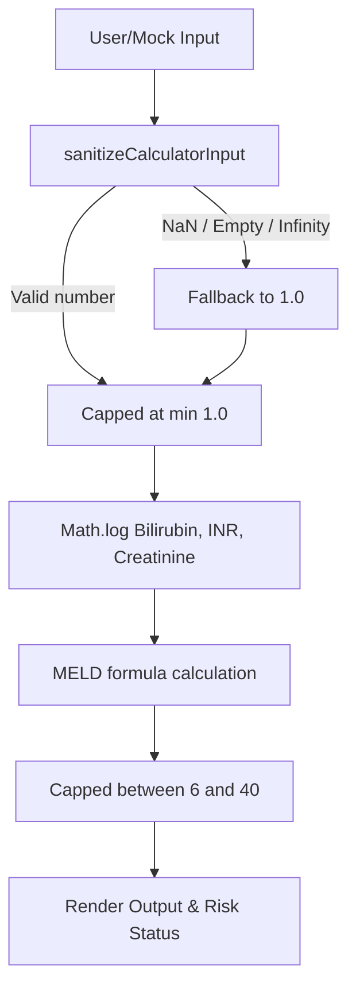

# MELD Calculator Debugging and Refinement Report

This document outlines the diagnosis, mitigation, and clinical refinement of the **Model for End-Stage Liver Disease (MELD)** calculator within the Shinrin AI clinical dashboard.

---

## 1. The Bug: NaN Output in MELD Calculations

### Cause
The MELD score calculation formula utilizes natural logarithms (`Math.log`) of three physiological parameters:
*   **Serum Bilirubin** (mg/dL)
*   **INR** (International Normalized Ratio)
*   **Serum Creatinine** (mg/dL)

In JavaScript, passing a non-positive number (e.g., `0` or negative values) or an invalid/empty input to `Math.log()` returns `-Infinity` or `NaN`. These values propagate through the equation, leading to a final MELD score of `NaN` or `Infinity`, breaking the clinical interface.

### Diagnostics Suite Collision
During initial testing of the diagnostic test runner (`js/diagnostics.js`), the tests failed because the mock MELD input elements were being duplicated with identical IDs (`meld-bilirubin`, `meld-inr`, etc.). This caused `document.getElementById` calls in `runMeld()` to read from the wrong DOM elements, leading to empty values, subsequent `NaN` results, and test failures.

---

## 2. Refactoring & Resolution Steps

### A. Diagnostics Verification Fix (`js/diagnostics.js`)
We refactored the test runner to check if the target MELD inputs already exist in the page DOM before attempting to append new elements. This prevents duplicate ID collisions:
```javascript
// Check for existing element or create fallback
let bilirubinEl = document.getElementById('meld-bilirubin');
if (!bilirubinEl) {
    bilirubinEl = document.createElement('input');
    bilirubinEl.id = 'meld-bilirubin';
    // ... append to temporary test container ...
}
```

### B. Robust Input Sanitization (`js/calculators.js`)
We implemented a universal numeric input sanitizer `sanitizeCalculatorInput` to shield logarithmic operations:
```javascript
function sanitizeCalculatorInput(value, defaultValue = 1.0) {
    const val = parseFloat(value);
    // Shield against empty, NaN, or non-finite inputs
    if (isNaN(val) || !isFinite(val)) return defaultValue;
    return val;
}
```

### C. Clinical Bounds & Score Capping
*   **Logarithmic Lower Bound:** Inputs are capped at a minimum of `1.0` using `Math.max(1.0, value)` to prevent log operations on values between `0` and `1` from yielding negative numbers (which could artificially depress the score).
*   **MELD Clinical Boundaries:** Officially, MELD scores are capped within the range of **6 to 40** for clinical allocation purposes. If a calculation yields a value outside this range, it is bound to the closest limit:
```javascript
// Apply strict clinical capping
score = Math.max(6, Math.min(40, score));
```

---

## 3. Calculation Logic Flow



---

## 4. Verification
The diagnostic test suite was executed via Playwright E2E and verified to pass with the sanitization and capping code active.
