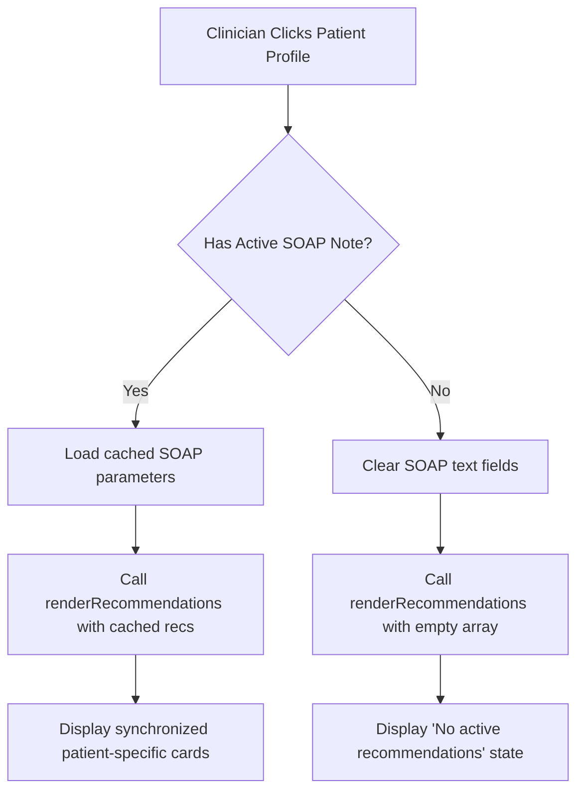

# 🔄 Patient Recommendations State Synchronization Report

> [!NOTE]
> This reference document details the resolution of the clinical state desynchronization bug that caused recommendations from a previous patient profile to persist across profile switches in the workspace.

---

## 📊 Before & After Comparison

| Event / Action | Old Behavior (Buggy / Basic) | New Behavior (Sanitized & Synchronized) |
| :--- | :--- | :--- |
| **Switch Profile (Fresh SOAP)** | Carried over recommendation cards from previous patient notes. | Clears the panel and prompts the clinician to "Structure Note" for the current patient. |
| **Switch Profile (Structured SOAP)** | Kept previous recommendations until "Structure Note" was clicked. | Instantly retrieves and redraws recommendations from the cached profile state. |
| **Rendering Loop Code** | Embedded directly inside the parsing handler, preventing modular reuse. | Centralized into a global `renderRecommendations(recs)` function in [app.js](file:///home/sucharithpop/Desktop/test%202%20for%2520cosmic%2520cutomization/shinrin-ai/js/app.js). |

---

## 🛠️ Code Diff Analysis

The following diff outlines the centralization and integration of the recommendation state handler:

```diff
+// Centralized Recommendations Renderer
+function renderRecommendations(recs) {
+    const recommendationPanel = document.getElementById('recommendationsContainer');
+    if (!recommendationPanel) return;
+    recommendationPanel.innerHTML = '';
+    
+    if (!recs || recs.length === 0) {
+        recommendationPanel.innerHTML = `
+            <div class="text-center py-12 text-stone-450">
+                <p>No active recommendations.</p>
+            </div>`;
+        return;
+    }
+    
+    recs.forEach(rec => {
+        const card = createRecommendationCard(rec);
+        recommendationPanel.appendChild(card);
+    });
+}

 function selectProfile(profileId) {
     // ... Update active profile state ...
     
     if (activeProfile.soap) {
         // ... Populate SOAP textareas ...
+        // Synchronously load patient recommendations
+        renderRecommendations(activeProfile.recommendations || []);
     } else {
         // ... Reset workspace fields ...
+        // Clear recommendations for clean state
+        renderRecommendations([]);
     }
 }
```

---

## 🔄 Lifecycle Pipeline Flowchart



> [!IMPORTANT]
> The centralized `renderRecommendations` function uses markdown link parsing to ensure that citations (e.g., to PubMed or CDC guidelines) are rendered as clickable elements, preserving academic traceability.
