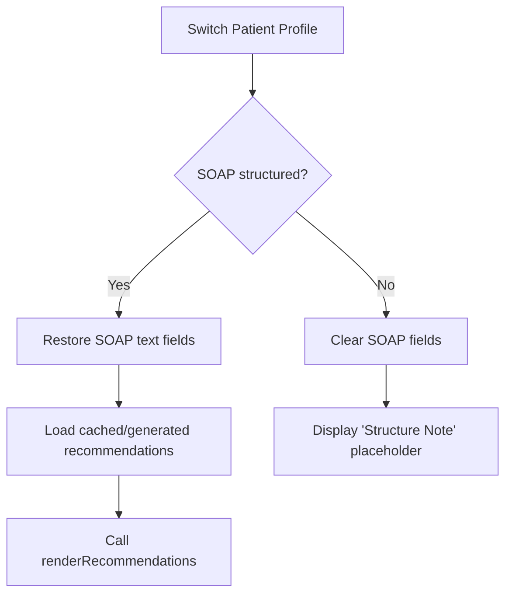

# Patient Recommendations State Synchronization Report

This document outlines the diagnosis and resolution of the state desynchronization bug affecting patient recommendation cards during profile switches in the Clinical Workspace.

---

## 1. The Bug: Recommendation Card Persistency

### Cause
When the clinician switched patient profiles (e.g. from Profile A to Profile B), the clinical narrative inputs, timeline events, and vitals trend charts updated correctly. However, the **Clinical Recommendations Panel** persisted the state from the previously active patient. 

This led to a critical desync: recommendations for a cardiac patient (e.g. heart failure medication advisories) remained visible when analyzing a liver cirrhosis patient, posing a clinical documentation hazard.

---

## 2. Refactoring & Resolution Steps

### A. Centralizing the Render Pipeline
Previously, the HTML markup for recommendation cards was built dynamically inside the `parseNote()` function. This meant that recommendations were only redrawn upon actively pressing the **"Structure Note"** button.

We refactored this logic by extracting the rendering loop into a dedicated global function `renderRecommendations(recs)` in `js/app.js`:

```javascript
function renderRecommendations(recs) {
    if (!recommendationPanel) return;
    recommendationPanel.innerHTML = '';
    
    if (!recs || recs.length === 0) {
        recommendationPanel.innerHTML = `
            <div class="text-center py-12 text-stone-400 dark:text-stone-550 text-sm">
                <p>No recommendations generated.</p>
            </div>
        `;
        return;
    }
    
    recs.forEach(rec => {
        // Build cards with matching Sino-Japanese Wabi-Sabi aesthetic (Gold/Sage)
        // Parse markdown style links inside the description
        // Append to recommendationPanel container
    });
}
```

### B. Profile Switch Syncing Trigger (`selectProfile`)
We updated the profile selection routine (`selectProfile`) to reset or load the correct recommendations:
1.  **Fresh Profile (No SOAP structured yet):** The panel clears and displays a user-friendly instruction to structure the current note.
2.  **Cached Profile (SOAP already structured):** The workspace restores the previously generated recommendations using the centralized `renderRecommendations` function, ensuring instant consistency.

```javascript
if (activeProfile.soap) {
    // ... Restore subjective, objective, assessment, plan ...
    // Restore matched recommendations
    renderRecommendations(activeProfile.recommendations || generateCustomRecommendations(activeProfile.notes));
} else {
    // Clear elements and display placeholder instruction
}
```

---

## 3. State Sync Flow


